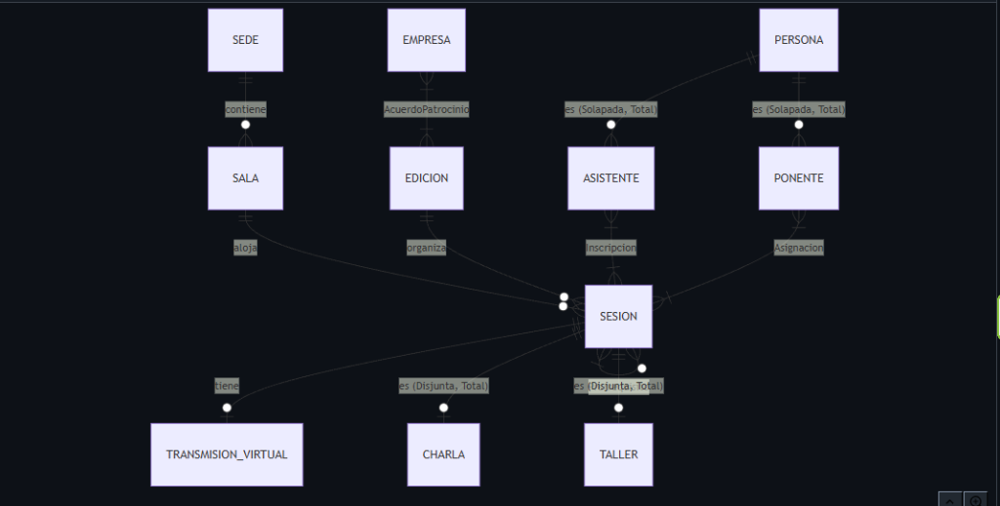
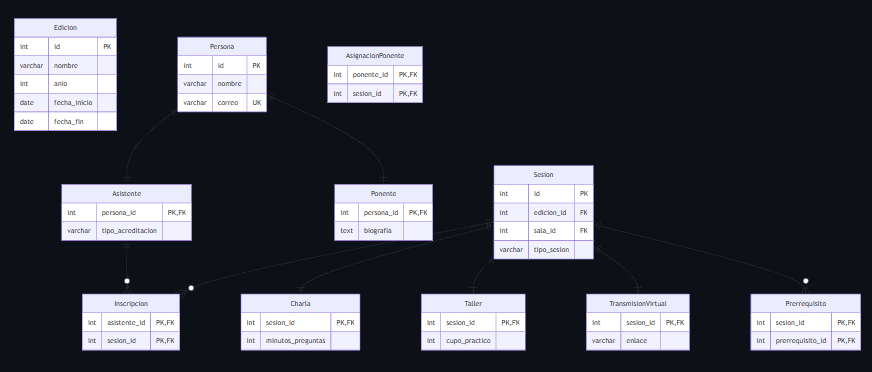

<div align="center">

# 🗄️ S7 — Narrativa al Modelo Relacional Avanzado
### ConectaTech · Sistema de Gestión de Congresos Profesionales

[](https://www.postgresql.org/)
[](https://docs.docker.com/compose/)
[](LICENSE)

> Proyecto académico: análisis narrativo, modelo ER avanzado y esquema relacional ejecutable en PostgreSQL 18 con Docker.

</div>

---

## 📋 Tabla de Contenidos

- [Descripción](#-descripción)
- [Estructura del Repositorio](#-estructura-del-repositorio)
- [Modelos](#-modelos)
- [Tecnologías](#-tecnologías)
- [Inicio Rápido](#-inicio-rápido)
- [Scripts SQL](#-scripts-sql)
- [Reglas de Negocio](#-reglas-de-negocio)
- [Restricciones Validadas](#-restricciones-validadas)
- [Video de Demostración](#-video-de-demostración)

---

## 📌 Descripción

**ConectaTech** organiza congresos profesionales **presenciales, virtuales e híbridos** en distintas ciudades.

Este proyecto transforma la narrativa del dominio en un esquema relacional completamente ejecutable, que incluye:

| ✅ Característica | Detalle |
|---|---|
| 🏗️ **15 tablas** | Modelado fiel a la narrativa |
| 🔗 **Relaciones** | 1:1, 1:N, N:M y Recursiva |
| 🌲 **Jerarquías** | Solapada (Persona) y Disjunta (Sesion) |
| 🛡️ **Restricciones** | PK, FK, UNIQUE, CHECK, NOT NULL, DEFAULT |
| 🐳 **Reproducible** | Desde cero con Docker Compose |
| ❌ **Validación** | 6 operaciones inválidas rechazadas |

---

## 📁 Estructura del Repositorio

```
s7-modelo-relacional-avanzado/
│
├── 📄 README.md                  ← Este archivo
├── 📄 narrativa-y-reglas.md      ← Narrativa completa + 12 reglas de negocio
├── 📄 diccionario-datos.md       ← Descripción de cada tabla
│
├── 🗺️  modelo-conceptual.mmd     ← Diagrama ER Conceptual (Mermaid)
├── 📐  modelo-logico.mmd         ← Diagrama Lógico Relacional (Mermaid)
├── 🖼️  diagrama-conceptual.png   ← Imagen exportada del modelo conceptual
├── 🖼️  diagrama-logico.png       ← Imagen exportada del modelo lógico
│
├── 🐳  compose.yaml              ← Docker Compose con PostgreSQL 18
├── 🔒  .env.example              ← Variables de entorno de ejemplo
├── 🚫  .gitignore
│
├── 🌐  index.html                ← Reporte HTML para entrega en Canvas (PDF)
│
└── 📂 sql/
    ├── 01_schema.sql             ← Creación de tablas y restricciones
    ├── 02_seed.sql               ← Datos de prueba
    ├── 03_queries.sql            ← Consultas de validación
    └── 04_invalid_tests.sql      ← Operaciones inválidas rechazadas
```

---

## 🗺️ Modelos

### Modelo Conceptual (ER)

> Elaborado en Mermaid. Incluye entidades, jerarquías, relaciones y cardinalidades.



**Jerarquías incluidas:**
- 👥 **Persona → Asistente / Ponente** — Solapada y Total (una persona puede ser ambas)
- 📋 **Sesion → Charla / Taller** — Disjunta y Total (solo puede ser una)

---

### Modelo Lógico (Relacional)

> Transformación del modelo conceptual a tablas con PK, FK y claves candidatas.



---

## ⚙️ Tecnologías

| Tecnología | Versión | Uso |
|---|---|---|
| 🐘 PostgreSQL | **18** (imagen fija) | Motor de base de datos |
| 🐳 Docker Compose | v2+ | Orquestación del contenedor |
| 📊 Mermaid | Live Editor | Diagramas ER |
| 🖊️ SQL puro | — | Sin ORM, sin generadores |

---

## 🚀 Inicio Rápido

### Prerrequisitos
- [Docker Desktop](https://www.docker.com/products/docker-desktop/) instalado y corriendo
- Cliente SQL: [DataGrip](https://www.jetbrains.com/datagrip/), [DBeaver](https://dbeaver.io/) o `psql`

### 1️⃣ Clonar el repositorio

```bash
git clone https://github.com/RobertGameros/S7-Modelo-Relacional-Avanzado.git
cd S7-Modelo-Relacional-Avanzado
```

### 2️⃣ Configurar variables de entorno

```bash
cp .env.example .env
# El valor por defecto ya funciona: DB_PASSWORD=postgres
```

### 3️⃣ Levantar PostgreSQL 18

```bash
docker-compose up -d
```

> **Conexión:** `localhost:5432` · DB: `conectatech` · User: `postgres` · Pass: `postgres`

### 4️⃣ Ejecutar los scripts en orden

```bash
# Usando psql dentro del contenedor:
docker exec -i conectatech_db psql -U postgres -d conectatech < sql/01_schema.sql
docker exec -i conectatech_db psql -U postgres -d conectatech < sql/02_seed.sql
docker exec -i conectatech_db psql -U postgres -d conectatech < sql/03_queries.sql
docker exec -i conectatech_db psql -U postgres -d conectatech < sql/04_invalid_tests.sql
```

> También puedes abrirlos directamente en DataGrip o DBeaver y ejecutarlos uno a uno.

### 5️⃣ Reiniciar desde cero

```bash
docker-compose down -v   # Elimina contenedor + volumen
docker-compose up -d     # Base de datos limpia
```

---

## 🗂️ Scripts SQL

| Script | Descripción | Elementos |
|---|---|---|
| `01_schema.sql` | Crea todas las tablas y restricciones | 15 tablas, PK, FK, CHECK, UNIQUE, DEFAULT |
| `02_seed.sql` | Inserta los datos de prueba | 2 ediciones, 6 personas, 6 sesiones, 8 inscripciones, 3 acuerdos |
| `03_queries.sql` | Consultas multi-tabla de validación | JOIN sobre Persona→Asistente→Inscripcion→Sesion→Edicion |
| `04_invalid_tests.sql` | Operaciones que deben fallar | 6 pruebas con 6 tipos de restricción distintos |

---

## 📐 Reglas de Negocio

| # | Regla | Restricción SQL |
|---|---|---|
| R1 | La fecha de fin no puede ser anterior a la de inicio | `CHECK (fecha_fin >= fecha_inicio)` |
| R2 | El correo de cada persona es único | `UNIQUE (correo)` |
| R3 | Una sesión es exactamente Charla o Taller | `CHECK (tipo_sesion IN ('Charla','Taller'))` |
| R4 | Un asistente no se inscribe dos veces en la misma sesión | `PRIMARY KEY (asistente_id, sesion_id)` |
| R5 | Ninguna sesión es prerrequisito de sí misma | `CHECK (sesion_id != prerrequisito_id)` |
| R6 | Una empresa solo tiene un acuerdo vigente por edición | `UNIQUE (empresa_id, edicion_id)` |
| R7 | La hora final de la sesión es posterior a la inicial | `CHECK (hora_fin > hora_inicio)` |
| R8 | La capacidad de sala es mayor a cero | `CHECK (capacidad > 0)` |
| R9 | El cupo práctico de taller es positivo | `CHECK (cupo_practico > 0)` |
| R10 | Los minutos de preguntas de una charla no son negativos | `CHECK (minutos_preguntas >= 0)` |
| R11 | El monto de un patrocinio no es negativo | `CHECK (monto >= 0)` |
| R12 | El año de una edición es posterior a 1999 | `CHECK (anio >= 2000)` |

---

## ❌ Restricciones Validadas (04_invalid_tests.sql)

| # | Operación Inválida | Tipo de Restricción | Error Esperado |
|---|---|---|---|
| 1 | Inscripción duplicada del mismo asistente | `PRIMARY KEY` | duplicate key value |
| 2 | FK a sala inexistente (sala_id = 999) | `FOREIGN KEY` | not present in table |
| 3 | fecha_fin anterior a fecha_inicio | `CHECK` | violates check constraint |
| 4 | Correo NULL en Persona | `NOT NULL` | violates not-null constraint |
| 5 | Sesión prerrequisito de sí misma | `CHECK` recursivo | violates check constraint |
| 6 | Segundo acuerdo de patrocinio misma empresa+edición | `UNIQUE` | duplicate key value |

---

## 🎬 Video de Demostración

> 📹 **Enlace al video (máx. 3 min):**
> [Ver en Google Drive](https://drive.google.com/drive/folders/1rsT8FCPpZ7aiTyq1t3qWWwalcTQky-Z4?usp=sharing)

**El video demuestra:**
- ✅ Modelo conceptual y lógico
- ✅ Creación de tablas desde base vacía
- ✅ Datos cargados y consulta multi-tabla
- ✅ Operaciones inválidas rechazadas por restricciones

---

<div align="center">

**Robert Gameros** · Ingeniería en Sistemas · Bases de Datos · 2026

</div>

